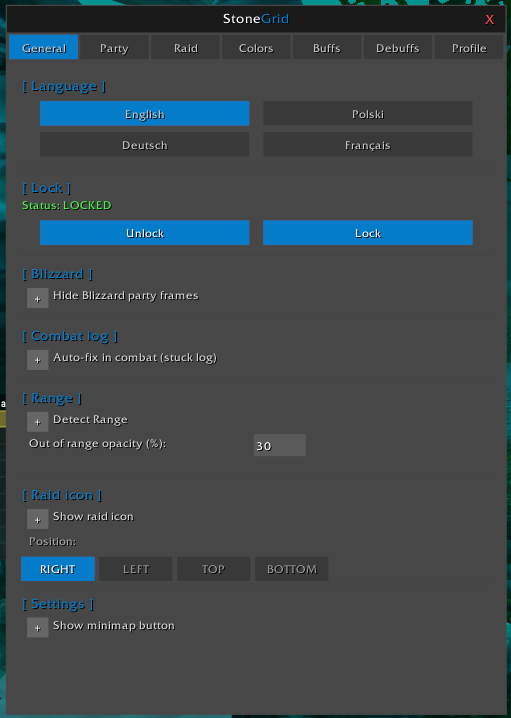
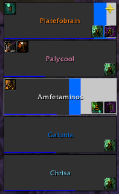
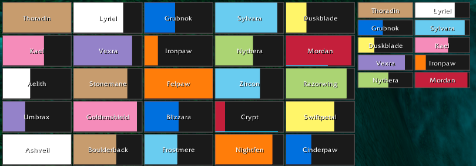
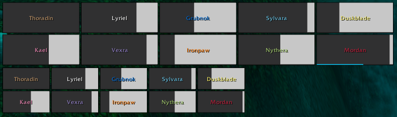

# StoneGrid

> ⚠️ **ALPHA v0.1 — early testing version.**
> Expect bugs, and breaking changes between updates.
> Please report any issues you find.

Lightweight party and raid unit frames addon for **World of Warcraft 3.3.5a (WotLK)**.

StoneGrid provides a custom unit frame system with party/raid layouts, profiles, incoming healing, auras, test mode and a custom configuration menu.

**Version:** 0.0.1 Alpha
**Interface:** 30300

---

# Screenshot





# Table of Contents

* [Installation](#installation)
* [Quick Start](#quick-start)
* [Commands](#commands)
* [Features](#features)
* [Profiles](#profiles)
* [Test Mode](#test-mode)
* [Dependencies](#dependencies)
* [Known Limitations](#known-limitations)
* [File Structure](#file-structure)
* [Reporting Bugs](#reporting-bugs)
* [License](#license)

---

# Installation

1. Copy the entire `StoneGrid` folder into:

```
World of Warcraft/Interface/AddOns/StoneGrid/
```

2. Make sure the folder contains:

```
StoneGrid.toc
Libs/
locales/
*.lua files
```

3. Enable **StoneGrid** in the addon list.

4. Reload your UI:

```
/reload
```

Do not copy individual files. The addon requires all included libraries.

---

# Quick Start

Open the configuration menu:

```
/sg
```

Basic setup:

1. Open the **General** tab.
2. Click **Unlock**.
3. Move your party or raid frames.
4. Click **Lock**.
5. Configure Party, Raid, Colors, Buffs and Debuffs.
6. Click **Save**.

---

# Commands

| Command          | Description            |
| ---------------- | ---------------------- |
| `/sg`            | Open StoneGrid menu    |
| `/stonegrid`     | Open StoneGrid menu    |
| `/sg lock`       | Lock frames            |
| `/sg unlock`     | Unlock frames          |
| `/sg test party` | Enable party test mode |
| `/sg test raid`  | Enable raid test mode  |
| `/sg test`       | Disable test mode      |

---

# Features

## Unit Frames

* Party frames.
* Raid frames.
* Arena support using party layout.
* Left-click targeting.
* Position saving per profile.
* Customizable layouts.

---

## Health System

* Health bars.
* Class colors.
* Custom health colors.
* Missing HP background.
* Target highlight.
* Incoming healing prediction.

Incoming heals are provided by:

```
LibHealComm-4.0
```

Supports:

* Direct heals.
* HoTs.
* Healing from other players.

---

## Power Bar

Optional power bar:

* Mana.
* Rage.
* Energy.

Supports druid shapeshift forms.

---

## Buffs and Debuffs

Customizable aura system:

* Buff icons.
* Debuff icons.
* CC icons.
* Icon size.
* Position.
* Maximum icons.
* Cooldown text.

---

## Pets

Party pets:

```
pet
partypet1-4
```

Raid pets:

```
raidpet1-40
```

Pet frames can be positioned:

* Left.
* Right.
* Top.
* Bottom.

---

## Raid Size Presets

Supported raid layouts:

* 10 players.
* 15 players.
* 25 players.
* 40 players.

Includes battleground detection:

* Warsong Gulch → 10
* Arathi Basin → 15
* Eye of the Storm → 15
* Strand of the Ancients → 15
* Alterac Valley → 40
* Isle of Conquest → 40

---

## Other Features

* Range detection.
* Raid target icons.
* Hide Blizzard party frames.
* Account-wide profiles.
* Separate active profile per character.
* Multiple languages:

Supported:

* English
* Polski
* Deutsch
* Français

---

# Profiles

StoneGrid supports profile management.

Features:

* Account-wide saved profiles.
* Different active profile per character.
* Saved settings.

Saved variables:

```
StoneGrid_Config
StoneGrid_ProfileDB
```

---

# Test Mode

Test mode allows testing layouts without a real group.

Available:

```
/sg test party
```

Creates a fake party.

```
/sg test raid
```

Creates a fake raid using the selected raid size preset.

---

# Dependencies

Included libraries:

* LibStub
* CallbackHandler-1.0
* AceLocale-3.0
* LibHealComm-4.0

Each library keeps its own license and copyright.

---

# Known Limitations

* Designed only for **World of Warcraft 3.3.5a**.
* Not compatible with Retail WoW.
* Range detection uses Blizzard API.
* Some changes may require leaving combat.
* Alpha version may contain bugs.

---

# File Structure

```
StoneGrid/
│
├── Core.lua
├── Party.lua
├── Raid.lua
├── UnitFrame.lua
├── Menu.lua
├── Profiles.lua
├── RaidSize.lua
├── Events.lua
├── Test.lua
│
├── Libs/
├── locales/
│
├── README.md
└── LICENSE
```

---

# Reporting Bugs

If you find a bug, please report it.

Include:

* What you were doing.
* What happened.
* What you expected.
* WoW client version.
* Error message if available.
* Screenshots if needed.

---

# License

StoneGrid is licensed under the **MIT License**.

Copyright (c) 2026 Platefobrain

See the `LICENSE` file for the full license text.

Third-party libraries included in the `Libs` folder are distributed under their own licenses.

